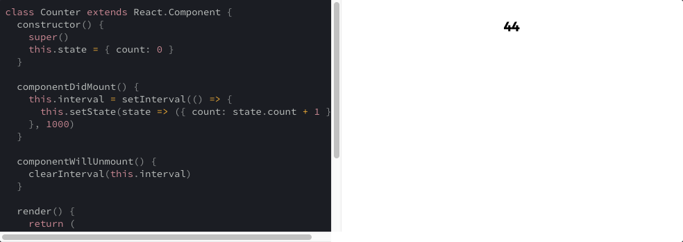

[](https://circleci.com/gh/ChristopherBiscardi/gatsby-mdx)
[](https://spectrum.chat/mdx)

# Gatsby MDX

Gatsby-MDX is a fully featured MDX transformer, runtime, and ecosystem
integrations for ambitious projects. It integrates [MDX][mdx] with
[Gatsby][gatsby] to enable rich JAMStack applications. Using
gatsby-mdx you can build [interactive software documentation
sites](#editable-code-blocks), [apply design system
components](#using-design-system-components) to rendered markdown,
[give a presentation][mdx-deck], and more...

## What is MDX?

MDX is a JSX in Markdown loader, parser, and renderer for ambitious projects.
It combines the readability of Markdown with the expressivity of JSX.
The best of both worlds. :globe_with_meridians:

[See the MDX specification](https://github.com/mdx-js/specification)

## Initial Setup

```bash
npm install gatsby-mdx @mdx-js/mdx @mdx-js/tag
```

then add `gatsby-mdx` to your `gatsby-config.js` in the `plugins` section.

```javascript
module.exports = {
  siteMetadata: {
    title: `My Ambitious Project`
  },
  plugins: [`gatsby-mdx`]
};
```

_Note: `gatsby-mdx` is [only compatible with Gatsby version 2 or
newer](https://github.com/ChristopherBiscardi/gatsby-mdx/issues/22)._

## Writing Pages in MDX

Add an `.mdx` file in the `src/pages` directory. It "Just Works".

```
# My first MDX Page

some awesome content
```

## Plugin Options

### File Extensions

`gatsby-mdx` can apply to different file extensions. By default it
conservatively applies to only `.mdx` files, but can also be made to apply to
`.md` files.

```javascript
module.exports = {
  plugins: [
    {
      resolve: `gatsby-mdx`,
      options: {
        extensions: [".mdx", ".md"]
      }
    }
  ]
};
```

## Default Layouts

MDX supports layouts using the default export as such:

```javascript
export default ({ children }) => (
  <div>
    <h1>My Layout</h1>
    <div>{children}</div>
  </div>
)


# My MDX

some content
```

or as an import:

```javascript
import PageLayout from './src/components/page-layout';
export PageLayout

# My MDX

some content
```

Sometimes you don't want to include the layout in every file, so `gatsby-mdx`
offers the option to set default layouts in the `gatsby-config.js` plugin
config. Set the key to the `name` set in the `gatsby-source-filesystem` config.
If no matching default layout is found, the `default` default layout is used.

You can also set `options.defaultLayout` if you only want to use one layout for
all MDX pages.

```javascript
module.exports = {
  siteMetadata: {
    title: `Gatsby MDX Kitchen Sink`
  },
  plugins: [
    {
      resolve: `gatsby-mdx`,
      options: {
        defaultLayouts: {
          posts: require.resolve("./src/components/posts-layout.js"),
          default: require.resolve("./src/components/default-page-layout.js")
        }
      }
    },
    {
      resolve: `gatsby-source-filesystem`,
      options: {
        name: `posts`,
        path: `${__dirname}/src/posts/`
      }
    }
  ]
};
```

### GraphQL

MDX files can be queried with `allMdx` on the root query. Like
`gatsby-transformer-remark`, this plugin adds fields to the Mdx node including
`excerpt`, `headings`, `timeToRead`, and `wordCount`.

All static exports – values that would be valid JSON – are queryable through the
`exports` field.

```graphql
query MDXQuery {
  allMdx {
    edges {
      node {
        relativePath
        fileAbsolutePath
        fileNode {
          name
        }
        timeToRead
        frontmatter {
          title
        }
        exports {
          author
        }
      }
    }
  }
}
```

## Programmatically Creating Pages

Pages can be created programmatically by combining `gatsby-source-filesystem` in
`gatsby-config.js` with some `createPage` calls.

```javascript
# gatsby-config.js
module.exports = {
  plugins: [
  `gatsby-mdx`,
    {
      resolve: "gatsby-source-filesystem",
      options: {
        name: "posts",
        path: `${__dirname}/content/`
      }
    }
  ]
};
```

```javascript
# gatsby-node.js
exports.createPages = ({ graphql, actions }) => {
  const { createPage } = actions;
  return new Promise((resolve, reject) => {
    resolve(
      graphql(
        `
          {
            allMdx {
              edges {
                node {
                  fileAbsolutePath
                  fileNode {
                    name
                  }
                }
              }
            }
          }
        `
      ).then(result => {
        if (result.errors) {
          console.log(result.errors);
          reject(result.errors);
        }

        // Create blog posts pages.
        result.data.allMdx.edges.forEach(({ node }) => {
          createPage({
            path: `/non-page/${node.fileNode.name}`,
            component: node.fileAbsolutePath, //blogPost,
            context: { absPath: node.absolutePath }
          });
        });
      })
    );
  });
};
```

# Getting Ambitious

## Using Design System Components

Using MDX, you can replace every HTML element that Markdown renders with a
custom implementation. This allows you to use a set of design system components
when rendering Markdown.

```js
// src/components/layout.js

import { MDXProvider } from "@mdx-js/tag";
import * as DesignSystem from "your-design-system";

export default function Layout({ children }) {
  return (
    <MDXProvider
      components={{
        // Map HTML element tag to React component
        h1: DesignSystem.H1,
        h2: DesignSystem.H2,
        h3: DesignSystem.H3,
        // Or define component inline
        p: props => <p {...props} style={{ color: "rebeccapurple" }} />
      }}
    >
      {children}
    </MDXProvider>
  );
}
```

## Editable Code Blocks

To make every markdown code block an editable live example, you can pass in a
custom `code` element to MDXProvider.



```javascript
import React, {Component} from "react";
import { LiveProvider, LiveEditor, LiveError, LivePreview } from "react-live";
import { MDXProvider } from '@mdx-js/tag'

const MyCodeComponent = ({ children, ...props }) => (
  <LiveProvider code={children}>
    <LiveEditor />
    <LiveError />
    <LivePreview />
  </LiveProvider>
);

export default MyPageLayout extends Component {
  render() {
    return <MDXProvider components={{code: MyCodeComponent}}>
      <div>{this.props.children}</div>
    </MDXProvider>
  }
}
```

---

# Experimental

Experimental things could be volatile. Use at your own risk.

## MDX Deck

To embed mdx-deck presentations in your gatsby site, add mdx deck to
your dependencies (in addition to the gatsby-mdx and it's
dependencies).

```shell
npm install mdx-deck
```

Add the relevant config to your `gatsby-config.js`. In this example,
we use set the required `decks` key in the gatsby-mdx plugin config to
point to our folder of slide decks and the filesystem source to point
to our decks folder. We also set a `defaultLayout` that wraps every
individual slide.

```javascript
const path = require("path");

module.exports = {
  siteMetadata: {
    title: `Gatsby MDX Kitchen Sink`
  },
  plugins: [
    `gatsby-plugin-emotion`,
    `gatsby-plugin-react-helmet`,
    {
      resolve: `gatsby-mdx`,
      options: {
        extensions: [".mdx", ".md"],
        decks: [path.resolve("./decks")],
        defaultLayouts: {
          default: require.resolve("./src/components/default-page-layout.js"),
          slides: require.resolve("./src/components/default-slide-layout.js")
        }
      }
    },
    {
      resolve: "gatsby-source-filesystem",
      options: {
        name: "slides",
        path: `${__dirname}/decks/`
      }
    },
    `gatsby-plugin-offline`
  ]
};
```

[mdx]: https://github.com/mdx-js/mdx
[gatsby]: https://www.gatsbyjs.org/
[mdx-deck]: https://github.com/jxnblk/mdx-deck
